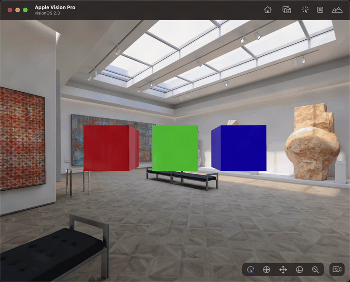

# RealityKit Experiments With VisionOS

This is a series of experiments with RealityKit and VisionOS.

## Cuboidal Random Walker

Did an experiment inspired by a classical exploration of randomness from the Nature Of Code book.

[Source](https://github.com/Volorf/VisionOS-Experiments/tree/main/Source/RealityKit%20Experiments/PROJECTS/Cuboidal%20Random%20Walker)

## Rotator

Implemented a simple rotator component.

[Source](https://github.com/Volorf/VisionOS-Experiments/tree/main/Source/RealityKit%20Experiments/PROJECTS/Rotator)