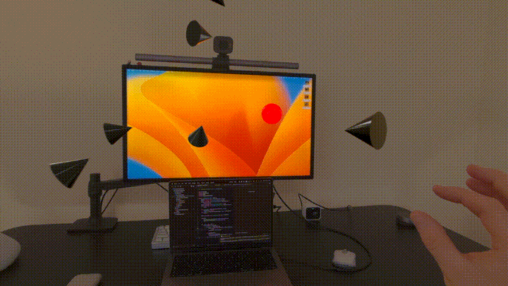
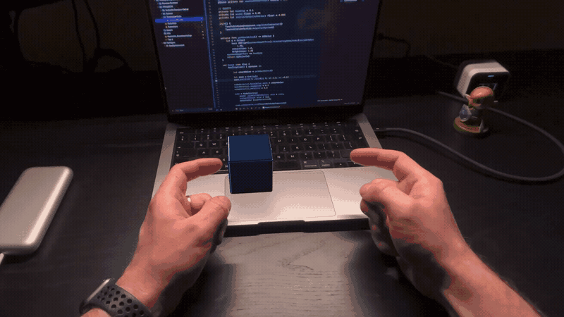
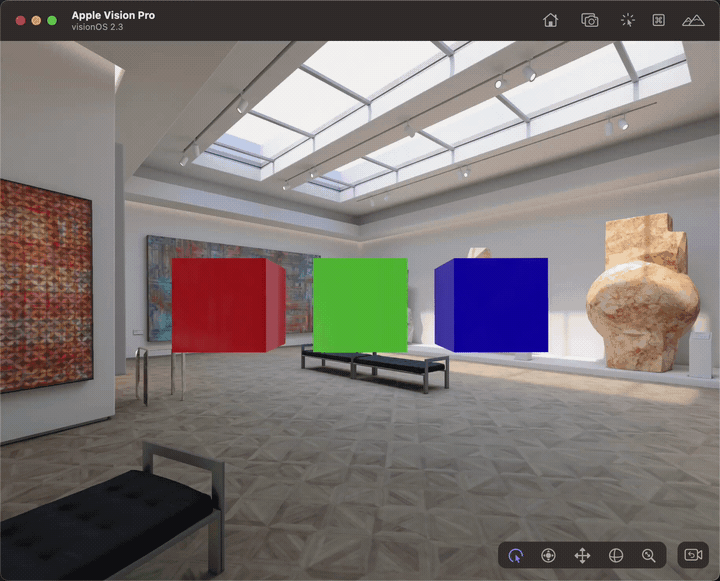

# RealityKit Experiments With VisionOS

This is a series of experiments with RealityKit and VisionOS.

## Arrows Attractor
Attractor simulation.
- [Source](https://github.com/Volorf/RealityKit-Experiments/blob/main/Source/RealityKit%20Experiments/PROJECTS/ArrowsAttractor/ArrowsAttractor.swift)
- [Learn More](https://x.com/Volorf/status/2026622007010324788)

## Touchable Cube
Poke to move a cube around. It casts shadow.
- [Source](https://github.com/Volorf/RealityKit-Experiments/blob/main/Source/RealityKit%20Experiments/PROJECTS/Touchable%20Cube/TouchableCube.swift)
- [Learn More](https://x.com/Volorf/status/2024071409010405466)

## Cuboidal Random Walker

Did an experiment inspired by a classical exploration of randomness from the Nature Of Code book.
- [Source](https://github.com/Volorf/VisionOS-Experiments/tree/main/Source/RealityKit%20Experiments/PROJECTS/Cuboidal%20Random%20Walker)
- [Learn More](https://x.com/Volorf/status/1900160186876072004)

## Rotator

Implemented a simple rotator component.

[Source](https://github.com/Volorf/VisionOS-Experiments/tree/main/Source/RealityKit%20Experiments/PROJECTS/Rotator)